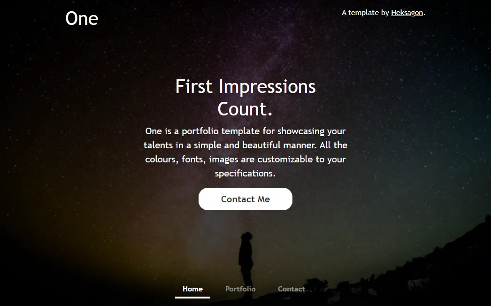
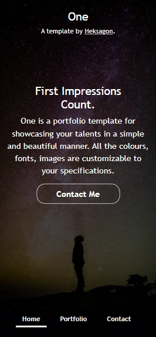

# ONE 
```by Heksagon```
## Click here >> [Live Demo](https://heksagonnet.github.io/one/) 
## Click here >> [Direct Download](https://github.com/heksagonnet/one/archive/main.zip) 
🔧Easy-Installation ⚡️Fast 📱Responsive
---
## Summary
One is a **beginner-friendly** portfolio template for showcasing your talents in a simple and beautiful manner. All the colours, fonts, and images are **customizable** to your specifications. Using a [Bootstrap 5.0 Framework](https://getbootstrap.com/docs/5.0/getting-started/introduction/), it is **responsive** and looks good in various screen resolutions from mobile devices, tablets to desktops. It is based on [Cover](https://getbootstrap.com/docs/5.0/examples/cover/).

---
## Preview
<p align="center">
  <kbd></kbd>
  <kbd></kbd>
</p>

---
## Performance (Lighthouse Report)

[Click here to check out the result](https://googlechrome.github.io/lighthouse/viewer/?gist=1271f3fcdeb0f0d6aa6f7ad32b9d49a9)

To keep it optimized, in the server that you choose to host, have a suitable caching policy and properly sized images.

---
## Support

If you like this template, please give a star, and consider supporting me at:

[](https://ko-fi.com/heksagon)

Your support is greatly appreciated 😊

---
## Installation
Check out our [installation guide here](https://www.heksagon.net/free-template/one/#installation-)

If you have any issues with the installation, [comment it here](https://www.heksagon.net/free-template/one/#graphcomment) or [contact us](https://www.heksagon.net/contact) directly.

---
## Template Guide
Check out the guide to [customizing this template here.](https://www.heksagon.net/free-template/one/#template-guide)

---
## Custom Installation
If you'd like to have a custom installation and further customization, you can [contact us](https://www.heksagon.net/contact) to request for a quotation.
